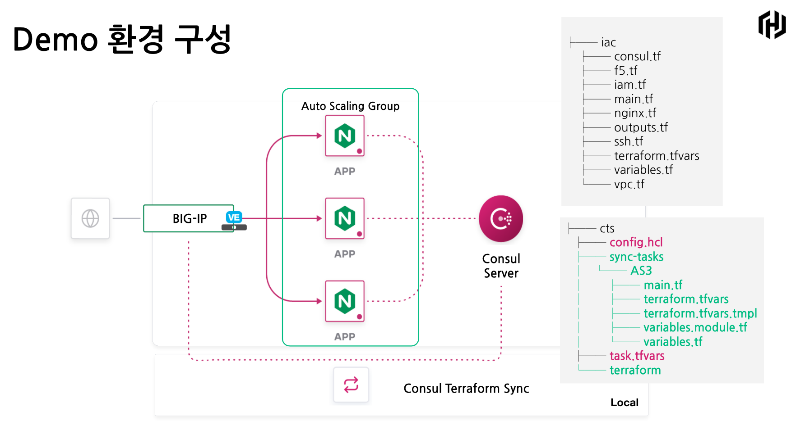
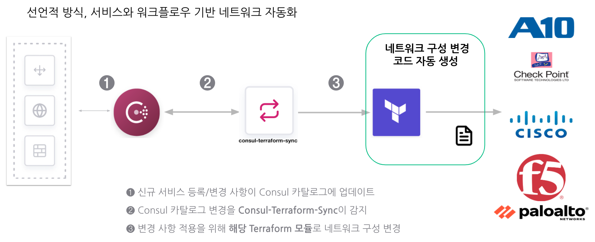

# Consul Terraform Sync을 이용한 네트워크 인프라 자동화 구현

## 


## 코드 구성

#### 사전 작업용

BIG-IP, NGINX 서버 그리고 Consul Server 구성을 위한 Terraform Configuration Tempalate으로 구성되며, iac 디렉토리에 위치. 사용자 환경에 맞게, terraform.tfvars의 variable을 수정하여 사용할 것


#### Consul Terraform Sync용 코드

Consul Terraform Sync를 동작시키기 위한 config.hcl과 task.tfvars 파일만 수정 또는 작성하면 됨.  Consul Terraform Sync 실행 시 sync-tasks디렉토리는 자동 생성되면서, 필요한 파일을 다운로드. (녹색으로 표시된 파일들)


## 동작 방식




## Demo 수행 방법

AWS Cloud Access Key는 환경 변수 또는 Terraform Variable로 선언 후 다음 작업을 진행할 것.


1. git repo 복제

   ```bash
   $ git clone https://github.com/jsp-hashicorp/nia_cts.git
   ```

   

2. iac 디렉토리로 이동하여 terraform.tfvars 파일 수정

   ```hcl
   #
   ## prefix will be added to resources created
   #
   
   prefix = "hc-jsp"
   
   # IP address to allow traffic from
   # recommended to use a /32 (single IP address)
   
   allow_from = "192.0.2.0/32"
   
   
   #
   # additional options 
   #
   
   region = "ap-northeast-2"
   f5_ami_search_name = "F5 BIGIP-15.1.0.4* PAYG-Good 25Mbps*"
   consul_dc = "dc1"
   ```

   

3. 다음 명령어 수행 후 출력되는 정보 확인 후 cts 디렉토리로 이동.

   ```bash
   $ terraform init
   $ terraform plan
   $ terraform apply
   ...
   Consul_UI = http://CONSUL_ADDR:8500
   F5_IP = F5_IP_ADDR
   F5_Password = PASSWORD
   F5_UI = https://F5_IP_ADDR:8443
   F5_Username = admin
   $ cd ../cts
   ```

4. cts 디렉토리에서 config.hcl을 해당 정보를 이용하여 수정

   ```hcl
   log_level = "debug"
   
   driver "terraform" {
     log = true
     required_providers {
       bigip = {
         source = "F5Networks/bigip"
       }
     }
     backend "consul" {
       address = "CONSUL_ADDR:8500"  <-- Consul IP 주소로 변경
       scheme  = "http"
       path    = "tf-state"
     }
   }
   
   consul {
     address = "CONSUL_ADDR:8500"  <-- Consul IP 주소로 변경
   }
   
   service {
     name = "nginx"
     datacenter = "dc1"
     id = "nginx"
   }
   
   provider "bigip" {
     address  = "https://F5_IP_ADDR:8443"  <-- F5_IP값으로 변경
     username = "admin"
     password = "PASSWORD" <-- F5_Password값으로 변경
   }
   
   task {
     name = "AS3"
     description = "Create AS3 Applications"
     source = "f5devcentral/app-consul-sync-nia/bigip"
     version = "0.1.2"
     providers = ["bigip"]
     services = ["nginx"]
     variable_files = ["task.tfvars"]
   }
   
   ```

5. Consul Terraform Sync 설치 후 다음과 같이 기동
   다음 주소에서 해당하는 binary를 다운로드 후 압축해제하여, PATH 상에 접근 가능한 경로에 복사.
   https://releases.hashicorp.com/consul-terraform-sync/0.1.0-techpreview1/

   ```bash
   $ mv ~/Downloads/consul-terraform-sync /usr/local/bin/consul-terraform-sync
   $ consul-terraform-sync -config-file config.hcl
   2020/12/16 06:09:17.551287 [INFO] 0.1.0-techpreview1 (2862363)
   2020/12/16 06:09:17.551439 [DEBUG] &Config{LogLevel:debug, InspectMode:false, Syslog:&SyslogConfig{Enabled:false, Facility:LOCAL0, Name:}, Consul:&ConsulConfig{Address:13.125.21.128:8500, Auth:&AuthConfig{Enabled:false, Username:, Password:}, KVNamespace:, KVPath:consul-terraform-sync/, TLS:&TLSConfig{CACert:, CAPath:, Cert:, Enabled:false, Key:, ServerName:, Verify:true}, Token:, Transport:&TransportConfig{DialKeepAlive:30s, DialTimeout:30s, DisableKeepAlives:false, MaxIdleConnsPerHost:17, TLSHandshakeTimeout:10s}}, Driver:&DriverConfig{Terraform:&TerraformConfig{Log:true, PersistLog:false, Path:/Users/jsp/HashiCorp/snapshot/nia_cts/cts, WorkingDir:/Users/jsp/HashiCorp/snapshot/nia_cts/cts/sync-tasks, Backend:map[consul:map[address:13.125.21.128:8500 gzip:true path:tf-state scheme:http]], RequiredProviders:map[bigip:map[source:F5Networks/bigip]]}}, Tasks:{&TaskConfig{Name:AS3, Description:Create AS3 Applications, Providers:[bigip], Services:[nginx], Source:f5devcentral/app-consul-sync-nia/bigip, VarFiles:[/Users/jsp/HashiCorp/snapshot/nia_cts/cts/task.tfvars], Version:0.1.2, BufferPeriod:&BufferPeriodConfig{Enabled:true, Min:10s, Max:40s}}}, Services:{&ServiceConfig{Name:nginx, Namespace:, Datacenter:dc1, Tag:, Description:}}, Providers:{&map[bigip:(redacted)]}, BufferPeriod:&BufferPeriodConfig{Enabled:true, Min:5s, Max:20s}}
   2020/12/16 06:09:17.551476 [INFO] (cli) setting up controller: readwrite
   2020/12/16 06:09:17.551489 [INFO] (ctrl) setting up Terraform driver
   2020/12/16 06:09:17.551764 [INFO] (ctrl) retrieved 0 Terraform handlers
   2020/12/16 06:09:17.576529 [INFO] (cli) initializing controller
   2020/12/16 06:09:17.576540 [INFO] (ctrl) initializing driver
   2020/12/16 06:09:17.576542 [INFO] (ctrl) initializing all tasks
   ...
   Apply complete! Resources: 0 added, 0 changed, 0 destroyed.
   2020/12/16 06:09:30.696874 [INFO] (ctrl) task completed AS3
   2020/12/16 06:09:30.696899 [INFO] (ctrl) all tasks completed once
   2020/12/16 06:09:30.696901 [INFO] (cli) running controller
   ```

6. AWS Console 또는 iac 디렉토리 상의 nginx.tf 상의 desired capacity를 변경. Consul Terraform Sync가 감지하여 BIG IP 상에 노드 멤버가 변경되는 지 확인.


## 참고

Network Infrastructure Automation Tech Preview - https://www.consul.io/docs/nia , https://www.consul.io/use-cases/network-infrastructure-automation

Load Balancing with F5 and Consul : https://learn.hashicorp.com/tutorials/consul/load-balancing-f5?in=consul/integrations


